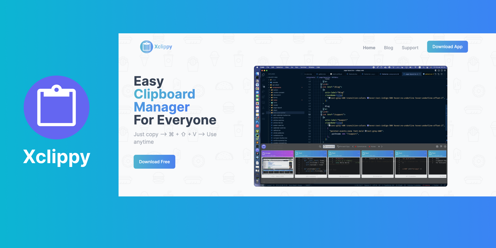

## Xclippy
Xclippy is a tool for anyone who wants to save time in their office life. Save clipboards and reuse its whenever you want.

### How to use Xclippy
- Use hotkey to quickly retrieve the contents of a previous clip:
  + `ctrl + {number}` on Windows or Linux
  + `command + {number}` on MacOS
- Use hotkey `(ctrl | command) + shift + ~` to quickly view list templates and select one by click or tabbing with tab key.
- Using snipping tool for capture your screen.
  + On MacOS: Press `⇧⌘4` to select an area of your screen.
  + On Windows: Press `Windows Key + Shift + S` to select an area of your screen

### Feedback
Let us know if you have ideas that can help make our products better. If you need help with solving a specific problem, please visit [the link](https://airtable.com/shrJIcyT0aT2POG2a)
